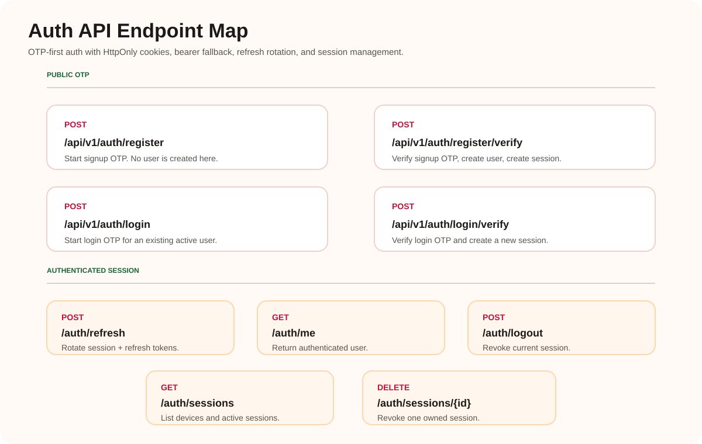

# Auth API

Mobile-first OTP authentication for Nikharta Roop.

## Token Policy

- `sessionToken`: 32 bytes / 256-bit entropy, returned in the response body and set as the `nr_session` HttpOnly cookie.
- `refreshToken`: 64 bytes / 512-bit entropy, returned in the response body and set as the `nr_refresh` HttpOnly cookie.
- Tokens are stored hashed in PostgreSQL.
- Browser clients should rely on HttpOnly cookies.
- API/mobile clients may use `Authorization: Bearer <sessionToken>` and JSON refresh bodies.

## Public OTP Endpoints

| Endpoint | Purpose |
| --- | --- |
| `POST /api/v1/auth/register` | Start signup OTP. Does not create a user. |
| `POST /api/v1/auth/register/verify` | Verify signup OTP, create user, verify mobile, create session. |
| `POST /api/v1/auth/login` | Start login OTP for an existing active user. |
| `POST /api/v1/auth/login/verify` | Verify login OTP and create session. |

## Session Endpoints

| Endpoint | Purpose |
| --- | --- |
| `POST /api/v1/auth/refresh` | Rotate refresh/session tokens. Uses `nr_refresh` cookie or JSON body. |
| `GET /api/v1/auth/me` | Return current authenticated user. |
| `POST /api/v1/auth/logout` | Revoke current session and clear auth cookies. |
| `GET /api/v1/auth/sessions` | List active sessions with `deviceName`, IP, user agent, and activity timestamps. |
| `DELETE /api/v1/auth/sessions/{sessionId}` | Revoke one session owned by the current user. |

## Session Device Names

`deviceName` is derived from the request `User-Agent` when a session is created or refreshed.

Examples:

- `Chrome on macOS`
- `Safari on iPhone`
- `Chrome on Android`
- `Edge on Windows`

Older sessions may have `deviceName: null` if they were created before this behavior existed.

## Main Error Cases

| Status | Meaning |
| --- | --- |
| `401` | Missing/invalid token or invalid OTP. |
| `403` | Account is inactive. |
| `404` | Account or session not found. |
| `409` | Account already exists. |
| `410` | OTP is missing or expired. |
| `423` | OTP is locked after failed attempts. |
| `429` | OTP resend cooldown is active. |
