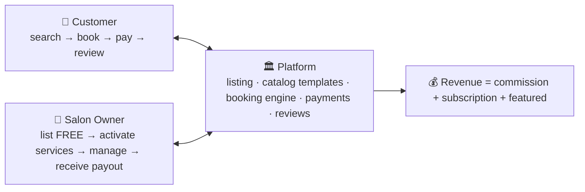
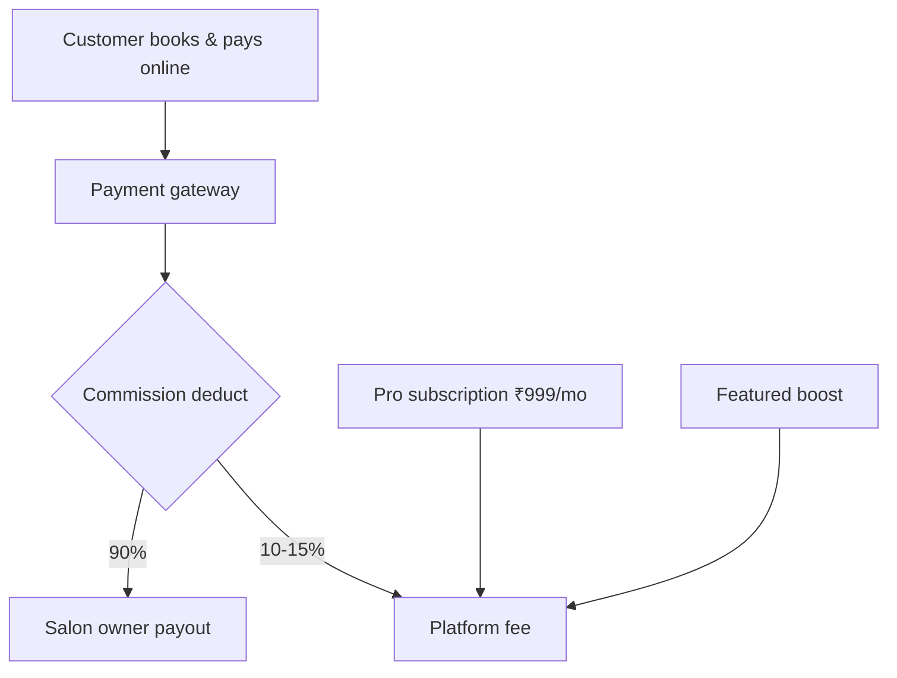

# Nikharta Roop — Business Model (Salon Marketplace)

Vision: **All-India salon marketplace** — koi bhi salon owner apna salon list kare, platform ke ready service/package templates activate kare, aur customers online book kare. Khud use karo, aur har kisi ko use karne do.

## Core question: Listing FREE ya PAID?

**Answer: Listing hamesha FREE. Paisa 3 aur jagah se.** (see `business-model.svg`)

| Layer | Kya hai | Paisa | Kyun |
| --- | --- | --- | --- |
| 1. Listing | Salon register + list + verification | **₹0 free** | Supply chahiye. Google Maps/JustDial free hai — paid listing pe koi nahi aayega |
| 2. Commission | Online booking success pe cut | **10–15%** per online payment | "Success fee" — salon ko customer mila tabhi platform ko paisa (Swiggy/Zomato model) |
| 3. Pro Subscription | Power features | **₹999–1999/mo** | Packages, staff analytics, SMS/WhatsApp marketing, multi-branch, low/zero commission |
| 4. Featured Boost | City me top placement | **₹500–3000/mo** | Jo salon growth chahta hai wo khud leta hai |

## Platform flow

## Monetization flow

## Activation model (tumhara idea — solid hai)

Platform ek **standard Indian salon catalog** rakhta hai (Hair, Skin, Bridal, Men's grooming, Packages...). Salon owner signup karke:

1. Apne city me services/templates **activate** karta hai (toggle ON/OFF)
2. Apna **price** set karta hai (city-wise suggest karo)
3. Custom services/packages bhi add kar sakta hai

Isse onboarding 5 minute ka ho jata hai — owner ko kuch banane ki zaroorat nahi, bas choose karna hai. Yehi "use karne me easy" wali feeling hai jo India me adoption laati hai.

## Roadmap

- **Phase 1 (abhi):** Free listing + booking + 10–15% commission → dono sides aaye
- **Phase 2 (50+ salons):** Pro subscription → stable monthly income
- **Phase 3:** Featured boosts, city-wise ads, enterprise (multi-branch chains)

## Risk (honest)

Commission model me salons customers ko offline le ja sakte hai ("aajao, direct book kar lo"). Isliye platform ko itni value deni hai ki owner platform pe hi rahe:
- Automatic calendar + reminders (owner ka time bachao)
- Customer database + loyalty (repeat customers)
- No-show protection (advance token booking)
- Analytics (kaunsa service chalta hai)

## Schema impact (current repo)

Business model ke liye schema me ye add karna hoga:
1. `Salon`: `verificationStatus`, `gstin`, `payoutAccount`, `plan` (FREE/PRO), `featuredUntil`
2. `Package` (combo/bridal) + `PackageService[]` + salon-owned offers (`Coupon.salonId?`)
3. `Payment` → `PaymentTransaction[]` (advance + baaki, partial payments, payouts)
4. `CatalogTemplate` (platform ka ready service/package catalog jise salon activate kare)
5. `PlanPricing` / `Subscription` tables
