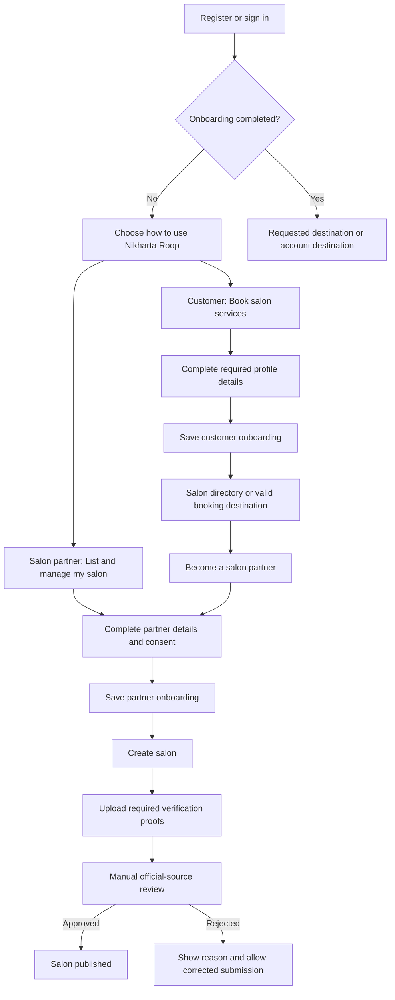

# Customer and Salon Partner Onboarding

Status: proposed implementation flow. This document does not change current application behavior.

## Purpose

Ask users what they want to do during onboarding, then guide them to booking or salon management. Keep customer access available to salon partners. Salon creation requires completed partner onboarding; publication requires the existing document verification process.

## User types and permissions

| Concept | Values | Responsibility |
| --- | --- | --- |
| Onboarding account type | Customer, Salon partner | Selected intent and initial destination |
| Platform role | Existing platform roles, including SUPER_ADMIN | Platform administration permissions |
| Salon membership | Existing OWNER, MANAGER and other salon roles | Permissions for a particular salon |

Selecting Salon partner must never grant a platform administrator role or ownership of an existing salon. Creating a salon establishes its OWNER membership through the existing creation transaction.

## Main flow

## Screens and copy

### 1. Choose an account type

Title: **How would you like to use Nikharta Roop?**

- **Customer** — Find salons and book services.
- **Salon partner** — List your salon and manage your business.

Require an explicit selection before continuing. Allow going back before completion. Explain that salon partners can also book services. Do not describe this choice as identity verification.

### 2. Customer onboarding

Reuse the existing profile fields and validation. Ask only for information required by the current customer flow, prefill known details, and avoid collecting business documents.

After saving, return to a valid internal booking destination when available; otherwise open the salon directory. Customers cannot create salons until partner onboarding is complete.

### 3. Partner onboarding

Collect the applicant's name and business contact details. Prefill existing account details. Require confirmation that the applicant owns the salon or is authorised to represent it.

Record explicit acceptance of the applicable partner terms, including the terms version and server acceptance timestamp. The final terms wording and publication location must be defined before release; do not treat an unspecified checkbox as consent.

Phone OTP requirements are still to be decided. Do not mark a phone number verified merely because onboarding was completed.

After successful completion, open the salon-create form. Keep salon-specific information, location, photos and verification documents in their existing flows rather than asking for them twice.

### 4. Salon creation and verification

The newly created salon stays inactive and the applicant becomes its OWNER. Redirect to the existing verification page.

Follow [Salon verification](./salon-verification.md) for required private proofs, reviewer evidence, rejection, suspension and publication rules. Partner onboarding must not bypass these checks. A suspended salon cannot be restored by repeating onboarding or submitting new documents.

## Proposed persisted state

Use a separate account-type value such as `CUSTOMER` or `SALON_PARTNER`. Keep partner completion and consent metadata separate from platform roles and salon memberships.

The existing `User.isOnboarded` field also appears in account/profile code. Inspect all writers and consumers before changing its meaning. Do not use it alone as permission to create a salon.

Persist partner completion only after the server validates required details and consent. Store completion time, terms version and terms acceptance time together. Account type alone is insufficient eligibility.

Do not store a second copy of profile contact fields unless a separate business contact is explicitly required. Prefer extending the existing user model and service conventions over introducing a new permission system.

## Backend enforcement

- Require authentication for onboarding writes and salon creation.
- Update only the authenticated user's onboarding state. Do not accept a client-supplied user ID, platform role or salon membership.
- Check current database eligibility in the salon creation service, so `POST /api/v1/salons` cannot bypass onboarding. A hidden button is not an access control.
- Return a clear machine-readable onboarding-required response when creation is blocked, and guide the client to partner onboarding.
- Keep repeated completion requests safe and prevent duplicate consent records caused by retries. Never reset verification status as an onboarding side effect.
- Validate return destinations as local, allowed routes; prevent external redirect URLs.
- Apply the existing authentication, request validation and request-protection conventions.

Any new onboarding routes or API paths remain proposals until implementation review. The existing salon creation and verification URLs remain unchanged.

## Returning and existing users

| User state | Expected behavior |
| --- | --- |
| Guest | Public browsing; sign in for protected actions |
| New user without a type | Show account-type onboarding after authentication |
| Completed customer | Browse and book; offer Become a salon partner |
| Incomplete partner | Resume partner onboarding; block salon creation |
| Completed partner without a salon | Allow salon creation |
| Existing salon OWNER | Preserve management access and recognise existing partner eligibility |
| Existing salon MANAGER or staff | Preserve membership access; do not infer permission to create another salon from membership alone |
| SUPER_ADMIN | Preserve administrative access; partner onboarding is still required to create a personally owned salon |

Define a migration/backfill for existing owners before enabling the creation gate. Existing customers should retain booking access without being forced through partner onboarding. Do not alter platform roles or existing salon memberships during backfill.

Once partner onboarding is completed, choosing a customer-facing destination must not erase partner eligibility or existing ownership. Account type controls the default experience rather than restricting a partner's ability to book.

## UI behavior

- Show Add salon to eligible partners; show Become a salon partner to customers.
- Protect direct access to the existing salon-create page with the same eligibility policy as the API.
- Display field errors near their inputs and explain why Continue is disabled.
- Preserve entered values after validation or network failures; show loading and retry states.
- Use existing shared controls, keyboard navigation, visible focus and responsive layouts.
- Keep management navigation available according to salon membership, regardless of the user's chosen customer destination.

## Implementation and verification scope

Implement the account-type selection, partner completion storage, creation gate, entry-point changes and owner backfill together. Review the schema and public API changes before implementation.

Verify customer and partner completion, customer-to-partner progression, direct creation API rejection, valid partner creation, retries, existing owner access, manager restrictions and unchanged SUPER_ADMIN review access. Check that onboarding never publishes a salon or grants administrator privileges. Keep the existing verification security tests passing.

## Decisions before implementation

1. Confirm exact required contact fields and whether phone OTP is mandatory.
2. Define partner terms content and version.
3. Confirm default destinations and treatment of interrupted booking flows.
4. Confirm the existing-owner backfill policy and schema/API shape.

Document verification and automated provider integration are separate from this onboarding scope.
